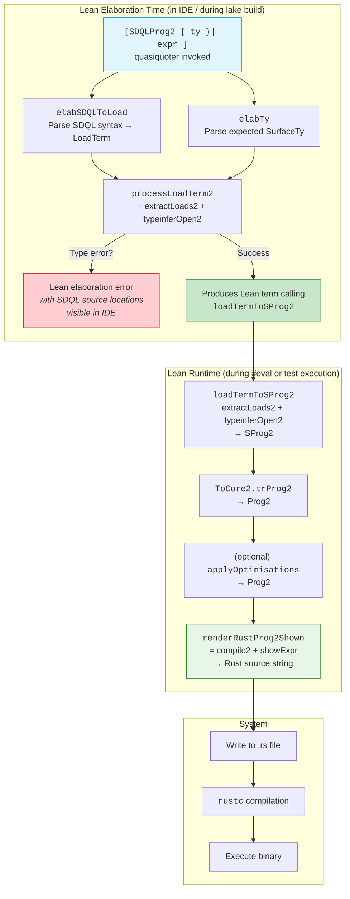
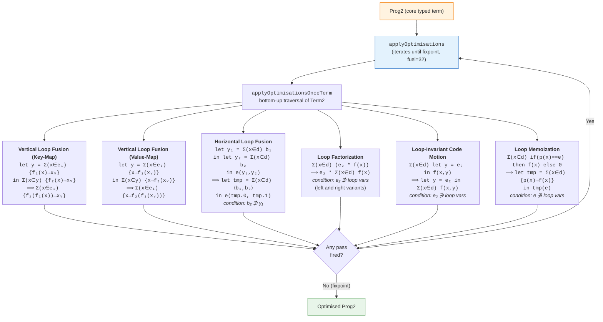
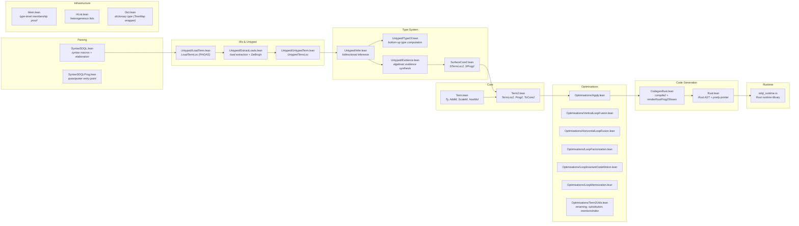

# SDQL Compilation Pipeline

## High-Level Overview

```mermaid
flowchart TD
    subgraph Input
        SRC["SDQL Source Text<br/><i>written inside Lean quasiquoter</i><br/><code>[SDQLProg2 { ty }| expr ]</code>"]
    end

    subgraph "Stage 1 — Parsing (Lean Elaboration Time)"
        direction TB
        SRC -->|"Lean syntax macros<br/>(SyntaxSDQL.lean)"| PARSE
        PARSE["<code>elabSDQLToLoad</code><br/>Lean macro expansion"]
        PARSE --> LT["<b>LoadTermLoc rep</b><br/>PHOAS AST<br/><i>Higher-order abstract syntax</i><br/><i>Contains <code>load</code> nodes for files</i><br/><i>Carries SourceLocation</i>"]
    end

    subgraph "Stage 2 — Load Extraction + DeBruijn Conversion"
        direction TB
        LT -->|"extractLoads2<br/>(ExtractLoads.lean)"| EXTRACT
        EXTRACT["1. <code>collectLoads</code>: gather <code>load</code> nodes<br/>&nbsp;&nbsp;&nbsp;(deduplicate by path, sort alphabetically)<br/>2. Instantiate PHOAS at <code>rep = Nat</code><br/>3. Convert levels → DeBruijn indices<br/>4. Replace <code>load</code> nodes with free variables"]
        EXTRACT --> UT["<b>UntypedTermLoc ctx</b><br/>DeBruijn-indexed (Fin ctx), untyped<br/><i>No load nodes (extracted to context)</i><br/><i>Carries SourceLocation</i>"]
        EXTRACT --> EL["<b>ExtractedLoads2</b><br/><code>ctx : List SurfaceTy</code><br/><code>loadPaths : List String</code><br/><code>term : UntypedTermLoc ctx.length</code>"]
    end

    subgraph "Stage 3 — Type Inference + Evidence Synthesis"
        direction TB
        UT -->|"typeinferOpen2<br/>(Infer.lean)"| TI
        TI["Bidirectional type inference<br/><code>TypeInfer2.infer2</code>"]
        TI -->|"bottom-up for sub-exprs"| TOF["<code>typeof2</code><br/>(TypeOf.lean)"]
        TI -->|"algebraic structure witnesses"| EV["Evidence Synthesis<br/>(Evidence.lean)"]
        TOF --> TI
        EV --> TI

        EV --> EV_D["<code>synthSAdd</code> → SAdd ty<br/><code>synthSScale</code> → SScale sc ty<br/><code>synthSHasMul</code> → SHasMul a b<br/><code>synthSHasClosure</code> → SHasClosure ty"]

        TI --> ST["<b>STermLoc2 ctx ty</b> / <b>SProg2</b><br/>DeBruijn-indexed (Mem ty ctx), typed<br/><i>SurfaceTy with named record fields</i><br/><i>Carries algebraic evidence</i>"]
    end

    subgraph "Stage 4 — Surface-to-Core Translation"
        direction TB
        ST -->|"ToCore2.trProg2<br/>(Term2.lean)"| TC
        TC["1. Type erasure: SurfaceTy → Ty<br/>&nbsp;&nbsp;&nbsp;(record field names erased)<br/>2. Evidence translation:<br/>&nbsp;&nbsp;&nbsp;SAdd → AddM, SScale → ScaleM,<br/>&nbsp;&nbsp;&nbsp;SHasMul → HasMul, SHasClosure → HasClosure<br/>3. Named projection → indexed projection<br/>&nbsp;&nbsp;&nbsp;(projByName HasField → proj index)<br/>4. Surface builtins → core builtins<br/>&nbsp;&nbsp;&nbsp;(SBuiltin → BuiltinFn)"]
        TC --> CT["<b>TermLoc2 ctx ty</b> / <b>Prog2</b><br/>DeBruijn-indexed (Mem ty ctx), typed<br/><i>Ty with positional records (no names)</i><br/><i>Core algebraic evidence</i>"]
    end

    subgraph "Stage 4b — Optimisation Passes (Optional)"
        direction TB
        CT -->|"applyOptimisations<br/>(Apply.lean)"| OPT
        OPT["Bottom-up traversal<br/>Iterate to fixpoint (fuel = 32)"]
        OPT --> VLF["Vertical Loop Fusion<br/>(Key-Map)"]
        OPT --> VLFV["Vertical Loop Fusion<br/>(Value-Map)"]
        OPT --> HLF["Horizontal Loop Fusion"]
        OPT --> LFL["Loop Factorization<br/>(Left)"]
        OPT --> LFR["Loop Factorization<br/>(Right)"]
        OPT --> LICM["Loop-Invariant<br/>Code Motion"]
        OPT --> LM["Loop Memoization<br/>(Lookup + Partition)"]
        VLF --> OCT
        VLFV --> OCT
        HLF --> OCT
        LFL --> OCT
        LFR --> OCT
        LICM --> OCT
        LM --> OCT
        OCT["<b>TermLoc2 ctx ty</b> / <b>Prog2</b><br/>(optimised, same IR)"]
    end

    subgraph "Stage 5 — Compilation to Rust AST"
        direction TB
        OCT -->|"Compile2.compile2<br/>(CodegenRust.lean)"| COMP
        COMP["Term-by-term translation:<br/>• var → Rust.var (Mem → Fin)<br/>• constants → Rust literals<br/>• add → dispatch on AddM evidence<br/>&nbsp;&nbsp;&nbsp;(scalar: binop, dict: dictAdd, tuple: tupleAdd)<br/>• mul → dispatch on ScaleM evidence<br/>• sum → mutable accum + forKV loop<br/>&nbsp;&nbsp;&nbsp;(sum over range → forRange)<br/>• lookup → lookupOrDefault<br/>• builtin → runtime function call"]
        COMP --> TYPEMAP["Type mapping (coreTyToRustTy):<br/>bool→bool, int→i64, real→Real,<br/>dict k v→Map k v, record→Tuple"]
        COMP --> RA["<b>Rust.ExprLoc ctx</b><br/>DeBruijn-indexed (Fin ctx)<br/><i>Untyped Rust AST</i><br/><i>Stmts: letDecl, assign, forKV, forRange</i>"]
    end

    subgraph "Stage 6 — Pretty-Printing"
        direction TB
        RA -->|"renderRustProg2Shown<br/>(CodegenRust.lean)"| PP
        PP["1. Emit runtime import header<br/>&nbsp;&nbsp;&nbsp;(<code>#[path = 'sdql_runtime.rs'] mod ...</code>)<br/>2. For each loaded table: emit<br/>&nbsp;&nbsp;&nbsp;<code>let xi = load_tbl(path) + build_col</code><br/>3. Render main expression<br/>&nbsp;&nbsp;&nbsp;(DeBruijn indices → named vars x0, x1, ...)<br/>4. Wrap in <code>fn main() { ... println!(...) }</code>"]
        PP --> RS["<b>Rust Source Code</b><br/>(String)"]
    end

    subgraph "Stage 7 — Rust Compilation + Execution"
        direction TB
        RS -->|"rustc"| BIN["Native Binary"]
        RT["<b>sdql_runtime.rs</b><br/>• Real, MaxProduct, Date types<br/>• SdqlAdd trait + dict_add<br/>• Extension functions (ext_eq, ext_dom, ...)<br/>• TBL file loading (load_tbl, build_col)<br/>• sdql_mul, sdql_closure<br/>• SDQLShow pretty-printing"] -->|"linked with"| BIN
        BIN --> OUT["Program Output"]
    end

    style SRC fill:#e1f5fe,stroke:#0288d1
    style LT fill:#fff3e0,stroke:#f57c00
    style UT fill:#fff3e0,stroke:#f57c00
    style EL fill:#f3e5f5,stroke:#7b1fa2
    style ST fill:#fff3e0,stroke:#f57c00
    style CT fill:#fff3e0,stroke:#f57c00
    style OCT fill:#fff3e0,stroke:#f57c00
    style RA fill:#fff3e0,stroke:#f57c00
    style RS fill:#e8f5e9,stroke:#388e3c
    style BIN fill:#e8f5e9,stroke:#388e3c
    style RT fill:#fce4ec,stroke:#c62828
    style OUT fill:#e8f5e9,stroke:#388e3c
```

## Intermediate Representations

```mermaid
flowchart LR
    subgraph "IR 1: LoadTermLoc rep"
        IR1["PHOAS<br/>Untyped<br/>Named fields ✓<br/>Load nodes ✓<br/>SourceLocation ✓"]
    end
    subgraph "IR 2: UntypedTermLoc ctx"
        IR2["DeBruijn (Fin ctx)<br/>Untyped<br/>Named fields ✓<br/>Load nodes ✗<br/>SourceLocation ✓"]
    end
    subgraph "IR 3: STermLoc2 ctx ty"
        IR3["DeBruijn (Mem ty ctx)<br/>Typed (SurfaceTy)<br/>Named fields ✓<br/>Load nodes ✗<br/>SourceLocation ✓"]
    end
    subgraph "IR 4: TermLoc2 ctx ty"
        IR4["DeBruijn (Mem ty ctx)<br/>Typed (Ty)<br/>Named fields ✗<br/>Load nodes ✗<br/>SourceLocation ✓"]
    end
    subgraph "IR 5: Rust.ExprLoc ctx"
        IR5["DeBruijn (Fin ctx)<br/>Untyped<br/>Named fields ✗<br/>Load nodes ✗<br/>SourceLocation ✓"]
    end
    subgraph "IR 6: String"
        IR6["Named variables<br/>Rust source text"]
    end

    IR1 -->|"extractLoads2"| IR2
    IR2 -->|"infer2"| IR3
    IR3 -->|"trProg2"| IR4
    IR4 -->|"compile2"| IR5
    IR5 -->|"showExpr"| IR6

    style IR1 fill:#fff3e0,stroke:#f57c00
    style IR2 fill:#fff3e0,stroke:#f57c00
    style IR3 fill:#e3f2fd,stroke:#1565c0
    style IR4 fill:#e3f2fd,stroke:#1565c0
    style IR5 fill:#fce4ec,stroke:#c62828
    style IR6 fill:#e8f5e9,stroke:#388e3c
```

## Elaboration-Time vs Runtime Split

```mermaid
flowchart TB
    subgraph "Lean Elaboration Time (in IDE / during lake build)"
        direction TB
        Q["<code>[SDQLProg2 { ty }| expr ]</code><br/>quasiquoter invoked"]
        Q --> E1["<code>elabSDQLToLoad</code><br/>Parse SDQL syntax → LoadTerm"]
        Q --> E2["<code>elabTy</code><br/>Parse expected SurfaceTy"]
        E1 --> E3["<code>processLoadTerm2</code><br/>= extractLoads2 + typeinferOpen2"]
        E2 --> E3
        E3 -->|"Type error?"| ERR["Lean elaboration error<br/><i>with SDQL source locations</i><br/><i>visible in IDE</i>"]
        E3 -->|"Success"| OK["Produces Lean term calling<br/><code>loadTermToSProg2</code>"]
    end

    subgraph "Lean Runtime (during #eval or test execution)"
        direction TB
        OK --> R1["<code>loadTermToSProg2</code><br/>extractLoads2 + typeinferOpen2<br/>→ SProg2"]
        R1 --> R2["<code>ToCore2.trProg2</code><br/>→ Prog2"]
        R2 --> R3["(optional) <code>applyOptimisations</code><br/>→ Prog2"]
        R3 --> R4["<code>renderRustProg2Shown</code><br/>= compile2 + showExpr<br/>→ Rust source string"]
    end

    subgraph "System"
        direction TB
        R4 --> R5["Write to .rs file"]
        R5 --> R6["<code>rustc</code> compilation"]
        R6 --> R7["Execute binary"]
    end

    style Q fill:#e1f5fe,stroke:#0288d1
    style ERR fill:#ffcdd2,stroke:#c62828
    style OK fill:#c8e6c9,stroke:#2e7d32
    style R4 fill:#e8f5e9,stroke:#388e3c
```

## Optimisation Passes Detail

```mermaid
flowchart TD
    INPUT["Prog2 (core typed term)"]
    INPUT --> APPLY["<code>applyOptimisations</code><br/>(iterates until fixpoint, fuel=32)"]

    APPLY --> ONCE["<code>applyOptimisationsOnceTerm</code><br/>bottom-up traversal of Term2"]

    ONCE --> VKM["<b>Vertical Loop Fusion (Key-Map)</b><br/><code>let y = Σ(x∈e₁) {f₁(x)→xᵥ}</code><br/><code>in Σ(x∈y) {f₂(x)→xᵥ}</code><br/>⟹ <code>Σ(x∈e₁) {f₂(f₁(x))→xᵥ}</code>"]
    ONCE --> VVM["<b>Vertical Loop Fusion (Value-Map)</b><br/><code>let y = Σ(x∈e₁) {x→f₁(xᵥ)}</code><br/><code>in Σ(x∈y) {x→f₂(xᵥ)}</code><br/>⟹ <code>Σ(x∈e₁) {x→f₂(f₁(xᵥ))}</code>"]
    ONCE --> HF["<b>Horizontal Loop Fusion</b><br/><code>let y₁ = Σ(x∈d) b₁</code><br/><code>in let y₂ = Σ(x∈d) b₂</code><br/><code>in e(y₁,y₂)</code><br/>⟹ <code>let tmp = Σ(x∈d) ⟨b₁,b₂⟩</code><br/><code>in e(tmp.0, tmp.1)</code><br/><i>condition: b₂ ∌ y₁</i>"]
    ONCE --> LF["<b>Loop Factorization</b><br/><code>Σ(x∈d) (e₂ * f(x))</code><br/>⟹ <code>e₂ * Σ(x∈d) f(x)</code><br/><i>condition: e₂ ∌ loop vars</i><br/>(left and right variants)"]
    ONCE --> LICM2["<b>Loop-Invariant Code Motion</b><br/><code>Σ(x∈d) let y = e₂ in f(x,y)</code><br/>⟹ <code>let y = e₂ in Σ(x∈d) f(x,y)</code><br/><i>condition: e₂ ∌ loop vars</i>"]
    ONCE --> LM2["<b>Loop Memoization</b><br/><code>Σ(x∈d) if(p(x)==e) then f(x) else 0</code><br/>⟹ <code>let tmp = Σ(x∈d) {p(x)→f(x)}</code><br/><code>in tmp(e)</code><br/><i>condition: e ∌ loop vars</i>"]

    VKM --> CHECK{Any pass<br/>fired?}
    VVM --> CHECK
    HF --> CHECK
    LF --> CHECK
    LICM2 --> CHECK
    LM2 --> CHECK

    CHECK -->|Yes| APPLY
    CHECK -->|"No (fixpoint)"| OUTPUT["Optimised Prog2"]

    style INPUT fill:#fff3e0,stroke:#f57c00
    style OUTPUT fill:#e8f5e9,stroke:#388e3c
    style APPLY fill:#e3f2fd,stroke:#1565c0
```

## Key Source Files

```mermaid
flowchart LR
    subgraph "Parsing"
        F1["SyntaxSDQL.lean<br/><i>syntax macros + elaboration</i>"]
        F1b["SyntaxSDQLProg.lean<br/><i>quasiquoter entry point</i>"]
    end

    subgraph "IRs & Untyped"
        F2["Untyped/LoadTerm.lean<br/><i>LoadTermLoc (PHOAS)</i>"]
        F3["Untyped/ExtractLoads.lean<br/><i>load extraction + DeBruijn</i>"]
        F4["Untyped/UntypedTerm.lean<br/><i>UntypedTermLoc</i>"]
    end

    subgraph "Type System"
        F5["Untyped/Infer.lean<br/><i>bidirectional inference</i>"]
        F6["Untyped/TypeOf.lean<br/><i>bottom-up type computation</i>"]
        F7["Untyped/Evidence.lean<br/><i>algebraic evidence synthesis</i>"]
        F8["SurfaceCore2.lean<br/><i>STermLoc2, SProg2</i>"]
    end

    subgraph "Core"
        F9["Term.lean<br/><i>Ty, AddM, ScaleM, HasMul</i>"]
        F10["Term2.lean<br/><i>TermLoc2, Prog2, ToCore2</i>"]
    end

    subgraph "Optimisations"
        F11["Optimisations/Apply.lean"]
        F12["Optimisations/VerticalLoopFusion.lean"]
        F13["Optimisations/HorizontalLoopFusion.lean"]
        F14["Optimisations/LoopFactorization.lean"]
        F15["Optimisations/LoopInvariantCodeMotion.lean"]
        F16["Optimisations/LoopMemoization.lean"]
        F17["Optimisations/Term2Utils.lean<br/><i>renaming, substitution, mentionsIndex</i>"]
    end

    subgraph "Code Generation"
        F18["CodegenRust.lean<br/><i>compile2 + renderRustProg2Shown</i>"]
        F19["Rust.lean<br/><i>Rust AST + pretty-printer</i>"]
    end

    subgraph "Runtime"
        F20["sdql_runtime.rs<br/><i>Rust runtime library</i>"]
    end

    subgraph "Infrastructure"
        F21["Mem.lean<br/><i>type-level membership proof</i>"]
        F22["HList.lean<br/><i>heterogeneous lists</i>"]
        F23["Dict.lean<br/><i>dictionary type (TreeMap wrapper)</i>"]
    end

    F1 --> F2
    F2 --> F3
    F3 --> F4
    F4 --> F5
    F5 --> F6
    F5 --> F7
    F7 --> F8
    F8 --> F10
    F9 --> F10
    F10 --> F11
    F11 --> F18
    F18 --> F19
    F19 --> F20
```
